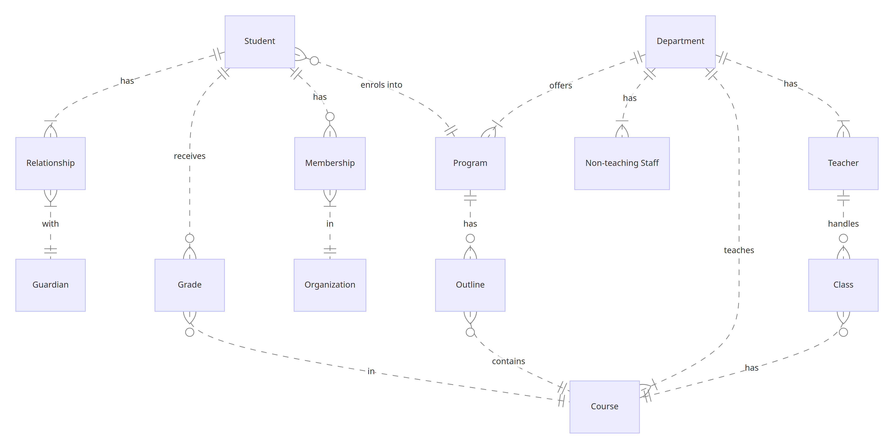

# SCHOOL MANAGEMENT APPLICATION DATABASE

By Clement Gyasi Siaw

Video overview: [Watch Video Overview](https://www.youtube.com/watch?v=o6OaXg6fO9I)

## Scope

The database for this CS50 final project includes all entities neccessary to facilitate the running of a School Management Application: As such, included in the database's scope is:

* Students, including basic identifying information, contact information, program of study, grade level, fees amount and photograph for identification purposes.
* Teachers, including basic identifying information, contact information, photograph for identification purposes and the department a teacher belongs to.
* Programs, including information about the program of study, program head, department and year in which the program is offered.
* Courses, which includes information about course code, course name, description, semester(s), year and department in which the course is taught.
* Departments, which includes the name of the department.
* Non-teaching Staff, including administrative staff, support staff, and their relevant details such as roles, contact information, and the department they belong to.
* Organisations, including the name and founding date of student organisations such as clubs, sports teams, memberships etc.
* Guardians, including basic identifying and contact information of all guardians of students enrolled in the school.
* Classes, which includes all courses taught by a teacher.
* Grades, which includes the grades of all courses taken by a student.
* Outlines, which includes all courses taken in a particular program.
* Memberships, which includes all student organisations that a student has joined and the role the student plays in that organisation.
* Relationships, which includes all guardians that students are affiliated to.

Out of scope are elements like certificates, transcripts, class schedules and room numbers, course attendance records of students, exam schedules, teacher timetables, library inventory, health, disciplinary and behavioral records of students and other attributes.

## Functional Requirements

This database will support:

* CRUD operations for students, teachers and other department staffs and administrators.
* Tracking all programs taught in each department in any academic year.
* Tracking all courses taught in each program per semester and per academic year.
* Identification of all courses taught by each teacher per semester and per academic year.
* Idenfication of all courses that each student is enrolled in.
* Tracking of all students' grades per course.
* Determining the total number of students enrolled in each course, department and grade level.
* Determining the total number of students in the school.
* Determining the average grade per course in a particular year.
* Calculation of students' GPA.
* Determining the highest performing students by GPA per program.
* Determination of whether a student is registered in any student organisations or not and the role(s) they play if true.
* Identification of guardian information of each student.
* Tracking the fee payment records of students.
* Identifying the roles of non-teaching staffs in each department.

Note that this database does not support CRUD operations for guardians. All guardian information will be provided and managed by students.

## Representation

Entities are captured in SQLite tables with the following schema.

### Entities

The database includes the following entities:

#### Students

The `students` table includes:

* `id`, which specifies the unique ID for the student as an `INTEGER`. This column thus has the `PRIMARY KEY` constraint applied.
* `student_id`, which specifies a unique ID code for the student as `TEXT`, since the code may consist of many different characters. A `UNIQUE` constraint ensures that different students do not have the same STUDENT ID.
* `first_name`, which specifies the student's first name as `TEXT`, given `TEXT` is appropriate for name fields.
* `last_name`, which specifies the student's last name. `TEXT` is used for the same reason as `first_name`.
* `username`, which specifies the student's login username as `TEXT`. `TEXT` is used for the same reason as `first_name`. A `UNIQUE` constraint ensures that different students do not have the same username.
* `password`, which is the student's login password as `TEXT`, given password may contain different characters such as alphabets, numbers, symbols etc.
* `grade_level`, which specifies the grade level of the student as `TEXT`, since grade level may be represented with non-numeric designations. eg. Kindergaten, KG, Primary etc.
* `program_id`, which is the unique ID of the program the student is enrolled in as an `INTEGER`. This column thus has the `FOREIGN KEY` constraint applied, referencing the `id` column in the `programs` table to ensure data integrity.
* `gender`, which represents the gender of a student as `TEXT`, given `TEXT` is appropriate for alphabetic representations. A `CHECK` constraint ensures that only two options are available to chosen from: 'M' for males and 'F' for females.
* `nationality`, which is the nationality of a student as `TEXT`. Given that this attribute stores the name of a country, it is of type affinity `TEXT`.
* `phone`, which represents the phone number of the student as `TEXT`. `TEXT` is used since phone numbers may include other non-numeric characters as '+', '-' etc. The phone number may also start with zeros which when represented with integers, will ignore the leading zeros.
* `email`, which specifies the student's email address as `TEXT`. This is because an email address may consist of different characters such as numbers, alphabets, symbols etc.
* `address`, which represents residential or postal address of the students. `TEXT` is used for the same reason as `email`.
* `date_of_birth`, which specifies the date of birth of the student. Dates in SQLite can be conveniently stored as `NUMERIC`, per SQLite documentation at <https://www.sqlite.org/datatype3.html>.
* `started`, which specifies when the student was enrolled in the program. Timestamps in SQLite can be conveniently stored as `NUMERIC`, per SQLite documentation at <https://www.sqlite.org/datatype3.html>. The default value for the `started` attribute is the current timestamp, as denoted by `DEFAULT CURRENT_TIMESTAMP`.
* `previous_school`, which specifies the name of the previous school attended by the student. `TEXT` is used for the same reason as `first_name`.
* `fees`, which represents the current fee amount required to be paid by the student. This column is represented with a `NUMERIC` type affinity, which can store either floats or integers. A `CHECK` constraint ensures that the value at this column is never less than 0. A default value of 50000 has been given, incase the school has not yet decided on a final figure.
* `photograph`, which specifies the photograph of the student for identification purposes. Photograph is of type affinity `BLOB` per SQLite documentation at <https://www.sqlite.org/datatype3.html>.

Apart from photograph, all columns are required and hence have the `NOT NULL` constraint applied where a `PRIMARY KEY` or `FOREIGN KEY` constraint is not.

#### Teachers

The `teachers` table includes:

* `id`, which specifies the unique ID for the teacher as an `INTEGER`. This column thus has the `PRIMARY KEY` constraint applied.
* `teacher_id`, which specifies a unique ID code for the teacher as `TEXT`, since the code may consist of many different characters. A `UNIQUE` constraint ensures that different teachers do not have the same TEACHER ID.
* `first_name`, which specifies the teacher's first name as `TEXT`.
* `last_name`, which specifies the teacher's last name as `TEXT`.
* `username`, which specifies the teacher's login username as `TEXT`. A `UNIQUE` constraint ensures that different teachers do not have the same username.
* `password`, which is the teacher's login password as `TEXT`.
* `department_id`, which specifies the unique ID of the department the teacher belongs to as an `INTEGER`. This column thus has the `FOREIGN KEY` constraint applied, referencing the `id` column in the `departments` table to ensure data integrity.
* `phone`, which represents the phone number of the teacher as `TEXT`.
* `email`, which specifies the teacher's email address as `TEXT`.
* `address`, which represents residential or postal address of the teacher as `TEXT`.
* `date_of_birth`, which specifies the date of birth of the teacher as `NUMERIC`.
* `started`, which specifies when the teacher was appointed as `NUMERIC`. The default value for the `started` attribute is the current timestamp, as denoted by `DEFAULT CURRENT_TIMESTAMP`.
* `photograph`, which specifies the photograph of the teacher as `BLOB`.

Apart from photograph, all columns are required and hence have the `NOT NULL` constraint applied where a `PRIMARY KEY` or `FOREIGN KEY` constraint is not.

#### Programs

The `programs` table includes:

* `id`, which specifies the unique ID for the program as an `INTEGER`. This column thus has the `PRIMARY KEY` constraint applied.
* `code`, which is the unique code used to identify the program as `TEXT`, given the code may consist of many different characters. A `UNIQUE` constraint ensures that different programs do not have the same code.
* `name`, which is the name of the program as `TEXT`.
* `description`, which is a brief description of what the program is about. `TEXT` is used to represent this column since it may consist of one or more sentences or paragraphs.
* `department_id`, which specifies the unique ID of the department that offers the program as an `INTEGER`. This column thus has the `FOREIGN KEY` constraint applied, referencing the `id` column in the `departments` table to ensure data integrity.
* `head_id`, which specifies the unique ID of the Program's Head as an `INTEGER`. The Head of program is one of the teachers in the department. This column thus has the `FOREIGN KEY` constraint applied, referencing the `id` column in the `teachers` table to ensure data integrity.
* `year`, which specifies the academic year in which the program is taught as an `INTEGER`. Year is of type affinity `INTEGER` in SQLite.

All columns are required and hence have the `NOT NULL` constraint applied where a `PRIMARY KEY` or `FOREIGN KEY` constraint is not.

#### Courses

The `courses` table includes:

* `id`, which specifies the unique ID for the course as an `INTEGER`. This column thus has the `PRIMARY KEY` constraint applied.
* `code`, which is the unique code used to identify the course as `TEXT`, given the code may consist of many different characters. A `UNIQUE` constraint ensures that different courses do not have the same code.
* `name`, which is the name of the course as `TEXT`.
* `description`, which is a brief description of what the course is about. `TEXT` is used to represent this column since it is appropriate for sentences and paragraphs.
* `semester`, which is the name of the semester in which the course is taught. `TEXT` is appropriate for representing words.  A `CHECK` constraint ensures that only four options including 'fall', 'winter', 'spring' and 'summer' can be chosen from.
* `year`, which specifies the year in which the course is taught as an `INTEGER`. Year is of type affinity `INTEGER` in SQLite.
* `department_id`, which specifies the unique ID of the department that teaches the course as an `INTEGER`. This column thus has the `FOREIGN KEY` constraint applied, referencing the `id` column in the `departments` table to ensure data integrity.

All columns are required and hence have the `NOT NULL` constraint applied where a `PRIMARY KEY` or `FOREIGN KEY` constraint is not.

#### Departments

The `departments` table includes:

* `id`, which specifies the unique ID for the department as an `INTEGER`. This column thus has the `PRIMARY KEY` constraint applied.
* `name`, which is the name of the department as `TEXT`. A `UNIQUE` constraint ensures that different departments do not have the same name.

All columns in the `departments` table are required and hence have the `NOT NULL` constraint applied.

#### Non-teaching Staff

The `non_teaching_staff` table includes:

* `id`, which specifies the unique ID for Non-teaching Staff members as an `INTEGER`. This column thus has the `PRIMARY KEY` constraint applied.
* `staff_id`, which specifies the unique ID code for the staf member as `TEXT`, since the code may consist of many different characters. A `UNIQUE` constraint ensures that different staff members do not have the same STAFF ID.
* `first_name`, which specifies the staff member's first name as `TEXT`.
* `last_name`, which specifies the staff member's last name as `TEXT`.
* `username`, which specifies the staff's login username as `TEXT`. A `UNIQUE` constraint ensures that different staff members do not have the same username.
* `password`, which is the staff's login password as `TEXT`.
* `role`, which is the role played by the staff member as `TEXT`, given that, words or sentences have type affinity of `TEXT`.
* `phone`, which represents phone number as `TEXT`.
* `email`, which specifies email address as `TEXT`.
* `address`, which represents residential or postal address of staff member as `TEXT`.
* `department_id`, which specifies the unique ID of the department the staff member belongs to as an `INTEGER`. This column thus has the `FOREIGN KEY` constraint applied, referencing the `id` column in the `departments` table to ensure data integrity.
* `photograph`, which specifies the photograph of the staff member as `BLOB`.

Apart from photograph, all columns are required and hence have the `NOT NULL` constraint applied where a `PRIMARY KEY` or `FOREIGN KEY` constraint is not.

#### Organisations

The `organisations` table includes:

* `id`, which specifies the unique ID for the student organisation as an `INTEGER`. This column thus has the `PRIMARY KEY` constraint applied.
* `name`, which specifies the name of the organisation as `TEXT`. A `UNIQUE` constraint ensures that different organisations do not have the same name.
* `started`, which specifies when the organisation was formed or started as `NUMERIC`. The default value for the `started` attribute is the current timestamp, as denoted by `DEFAULT CURRENT_TIMESTAMP`.

All columns are required in the `organisations` table and hence have the `NOT NULL` constraint applied.

#### Guardians

The `guardians` table includes:

* `id`, which specifies the unique ID for guardians as an `INTEGER`. This column thus has the `PRIMARY KEY` constraint applied.
* `name`, which specifies the guardian's name as `TEXT`.
* `phone`, which represents the guardian's phone number as `TEXT`.
* `email`, which specifies email address as `TEXT`.
* `address`, which represents residential or postal address as `TEXT`.

All columns in the `guardians` table are required and hence should have the `NOT NULL` constraint applied. No other constraints are necessary.

#### Classes

The `classes` table includes:

* `teacher_id`, which specifies the unique ID for the teacher that teaches the course as an `INTEGER`. This column thus has the `FOREIGN KEY` constraint applied, referencing the `id` column in the `teachers` table to ensure data integrity.
* `course_id`, which specifies the unique ID for the course which is taught by the teacher as an `INTEGER`. This column thus has the `FOREIGN KEY` constraint applied, referencing the `id` column in the `courses` table to ensure data integrity.

The `PRIMARY KEY` of this table is composed of two colums: `teacher_id` and `course_id` to ensure that, a teacher is NOT registered to teach a particular course more than once on the table. All columns on the `classes` table are required since all attributes have either a `PRIMARY KEY` or `FOREIGN KEY` constraint.

#### Grades

The `grades` table includes:

* `student_id`, which specifies the unique ID for the student that obtained the grade in the course as an `INTEGER`. This column thus has the `FOREIGN KEY` constraint applied, referencing the `id` column in the `students` table to ensure data integrity.
* `course_id`, which specifies the unique ID for the course in which the student obtained the grade as an `INTEGER`. This column thus has the `FOREIGN KEY` constraint applied, referencing the `id` column in the `courses` table to ensure data integrity.
* `grade`, which is the grade obtained by the student in the course. This column is represented with a `NUMERIC` type affinity, which can store either floats or integers. A `CHECK` constraint ensures that the value at this column is greater than 0 and less than or equal to 100.

The `PRIMARY KEY` of this table is composed of two colums: `course_id` and `student_id` to ensure that, a student's grade in a particular course is recorded NOT more than once on the table. All columns are required and hence have the `NOT NULL` constraint applied where a `PRIMARY KEY` or `FOREIGN KEY` constraint is not.

#### Outlines

The `outlines` table includes:

* `program_id`, which is the unique ID of the program as an `INTEGER`. This column thus has the `FOREIGN KEY` constraint applied, referencing the `id` column in the `programs` table to ensure data integrity.
* `course_id`, which is the unique ID of the course which is part of the program as an `INTEGER`. This column thus has the `FOREIGN KEY` constraint applied, referencing the `id` column in the `courses` table to ensure data integrity.

The `PRIMARY KEY` of this table is composed of two colums: `program_id` and `course_id` to ensure that, a course is NOT registered to the same program more than once on the table. All columns are required and hence have the `NOT NULL` constraint applied where a `PRIMARY KEY` or `FOREIGN KEY` constraint is not.

#### Memberships

The `memberships` table includes:

* `student_id`, which specifies the unique ID for the student that joins the organisation as an `INTEGER`. This column thus has the `FOREIGN KEY` constraint applied, referencing the `id` column in the `students` table to ensure data integrity.
* `organisation_id`, which is the unique ID of the organisation that the student has joined as an `INTEGER`. This column thus has the `FOREIGN KEY` constraint applied, referencing the `id` column in the `organisations` table to ensure data integrity.
* `role`, which is the role played by the student in the organisation as `TEXT`, given words have type affinity of `TEXT`.

The `PRIMARY KEY` of this table is composed of two colums: `student_id` and `organisation_id` to ensure that, a student is NOT registered to an organisation more than once on the table. All columns are required and hence have the `NOT NULL` constraint applied where a `PRIMARY KEY` or `FOREIGN KEY` constraint is not.

#### Relationships

The `relationships` table includes:

* `student_id`, which specifies the unique ID for the student as an `INTEGER`. This column thus has the `FOREIGN KEY` constraint applied, referencing the `id` column in the `students` table to ensure data integrity.
* `guardian_id`, which specifies the unique ID for the guardian whose ward / student is enrolled in the school as an `INTEGER`. This column thus has the `FOREIGN KEY` constraint applied, referencing the `id` column in the `guardians` table to ensure data integrity.

The `PRIMARY KEY` of this table is composed of two colums: `student_id` and `guardian_id` to ensure that, a student is NOT linked to the same guardian more than once on the table. All columns are required since all attributes have either a `PRIMARY KEY` or `FOREIGN KEY` constraint.

### Entity Relationships

The below entity relationship diagram describes the relationships among the entities in the database.

As detailed by the diagram:

* A relationship is associated with one and only one student whereas one student can have one to many relationships. One, if the student has only one guardian (for exampple, a single parent), and many if the student has more than one guardian.
* A relationship is associated with one and only one guardian. At the same time, one guardian can have one to many relationships if they have one or more wards in the school.
* One student may receive 0 to many grades. O, if the student is yet to receive a grade on any course, and many if the student receives a grade on more than one course. A grade is associated with one and only one student. It is assumed that students submit individual assignments or exams (not group work) and therefore receive individual grades.
* A grade is associated with one and only one course. At the same time, a course can get 0 to many grades. 0, if no student has received a grade on the course, and many if more than one student has received a grade on the course.
* A membership is associated with one and only one student whilst a student may have 0 to many memberships. 0, if the student is not registered to any organisation, and many if the student becomes a member of more than one organisation.
* A membership is associated with one and only one organisation whilst an organisation can have one to many memberships. One, if only one student has joined the organisation and many, if more than one student has joined the organisation.
* A student is capable of enrolling into one and only one program whereas a program can have 0 to many students. 0, if no student has yet been accepted into the program and many, if more than one student is enrolled into the program.
* An outline is associated with one and only one program whilst one program can have 0 to many outlines. 0, if a course has not yet been added to a program, and many if the program has more than one course.
* An outline is associated with one and only one course whereas a course may be part of 0 to many outlines. 0, if the course is not part of any program, and many if the course is part of more than one program.
* One department can teach one to many courses whilst a course is taught by one and only one department, even though that course may be taught in a program offered by a different department.
* One department may have one or more programs whilst a program is associated with one and only one department.
* One department may have one or more non-teaching staffs whilst a non-teaching staff is a member of one and only one department.
* A department may have one or more teachers whilst a teacher is a member of one and only one department.
* A class is associated with one and only one teacher whereas a teacher can have 0 to many classes. 0, if the teacher has not yet been assigned a course to teach, and many if the teacher has more than one course to teach.
* A class is associated with one and only one course but a course can have 0 to many classes. 0, if no teacher teaches the course, and many if more than one teacher teaches the course.

## Optimizations

Per the typical queries in `queries.sql`, it is common for users of the database to access information like GPA, names of courses, grades, and program of study of a particular student. For these reasons:
* Indexes are created on the `first_name` and `last_name` columns of the `students` table to speed the identification of students by those columns.
* An index is also created on the `grade` column of the `grades` table to speed up the search of students' grades and the calculation of their GPA.
* Similarly, an index is created on the `name` column of the `programs` table to speed up the search of the names of programs that a particular student is enrolled in or that are offered by the school.

Students may also search for the names of courses that are offered in a particular program. For this reason, indexes are created on the `course_id` and `student_id` columns of the `outlines` table to speed the search of courses by those columns.

Finally, it is a common practice for a user of the database to be concerned with viewing all the latest programs that are offered by the school. For that reason, a temporary view titled "2023" is created to speed up search. An index in the `year` column of the `programs` table is also created to speed up the search of programs offered in 2023.

## Limitations

The current schema does not have a log to record fee payment transactions of students. A transaction table would be required to record the timestamp of payment and the amount of fees paid by each student.

